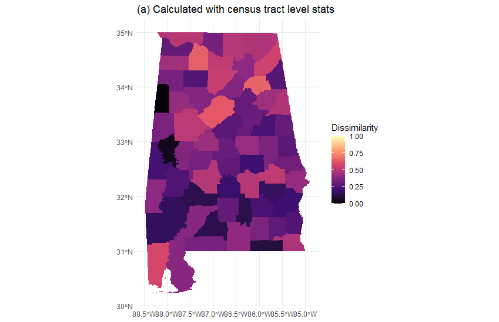
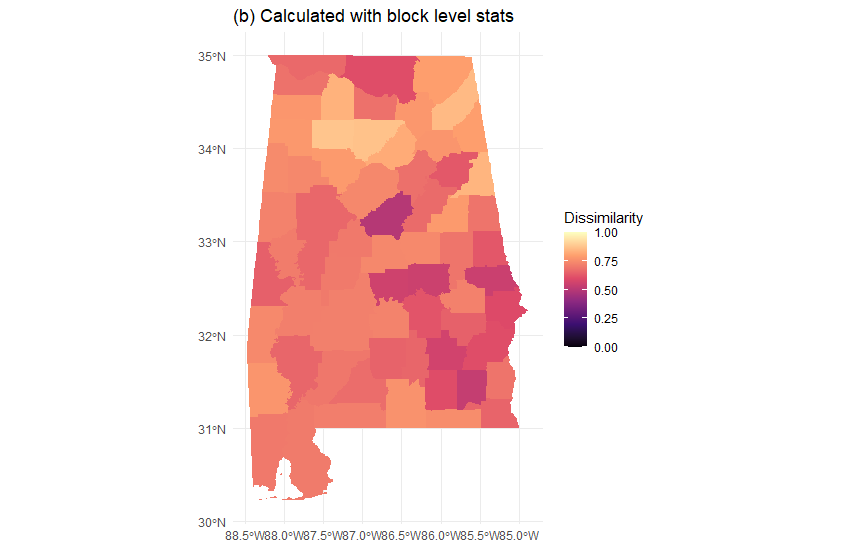

```{r setup, include=FALSE}
knitr::opts_chunk$set(eval=FALSE, echo = TRUE)
```

# Outline {.unlisted .unnumbered}

* Motivation

* Pipeline Demonstration

* Discussion


# Motivation
## Why reproducible pipeline?

- Growing number of data requests since the publication of Cummings et al. (2021)

- Up the research reproducibility game

  - Growing emphasis in biomedical science research [@Heil2021], and public health research [@Peng2020]
  - See my previous talk [_Reproducible Data Analysis Workflow_](https://boyiguo1.github.io/talks/2020-07-16-Reproducible-Analysis-Workflow.pdf) for easy starts 


# Pipeline Demonstration
## Preparation
* Software & Package Installation
  * Git: [https://git-scm.com/book/en/v2/Getting-Started-Installing-Git](https://git-scm.com/book/en/v2/Getting-Started-Installing-Git)
  * R (recommend 4.0+, minimial 3.6+) & RStudio: [https://www.rstudio.com/products/rstudio/download/](https://www.rstudio.com/products/rstudio/download/)
  * R package `renv`: [https://rstudio.github.io/renv/index.html](https://rstudio.github.io/renv/index.html)

## Download Remote GitHub Repository
* Download the remote repository via https://github.com/boyiguo1/Tutorial-Residential_Segregation_Score
  * No GitHub account required
  * Download ZIP, de-compress and open the R project, i.e. `*.Rproj` file
  * [Advanced approach:] Create new project with version control
* Install the R packages with `renv`
    ```{r}
    renv::restore()
    ```

## Set up your census API key
* Acquire your census api key string via https://api.census.gov/data/key_signup.html
* Replace your census API key in `_targets.R`
  * Search the file with the keyword "TODO:"


## Run the pipeline
* To run the pipeline `tar_make()`
* To fetch a target object: `tar_load(object)`, e.g. `tar_load(rs_indices)` for the calcualted indices
* Other Utility
  - Pipeline progress or modification since last run
    ```r
    tar_visnetwork()
    ```
  - Check _Addins_ in the tool bar

There are many other fantastic functions from the R package `targets`. Please see https://books.ropensci.org/targets/walkthrough.htmls.

## Switching between examples
If you [clone](https://docs.github.com/en/repositories/creating-and-managing-repositories/cloning-a-repository)/[fork](https://docs.github.com/en/get-started/quickstart/fork-a-repo) the remote repository
* RStudio graphic user interface: View -> Show Git -> Dropdown list.
* Command line: `git checkout ChangeToBranchName`

If you download the ZIP file, you need to switch to other branch on GitHub and download again.


## Customization
* Understand the file system
  * `_targets.R`: the master file containing all steps of analysis
    * Similar to a normal R script file except that the assignment of objects follows a new syntax
    * `tar_target(name, command)` translate to `name <- command`
    * Use global search (`cmd/control + shift + f`) to find all places needs customization
  * Self-defined functions are located in the folder `R`
    * You can use these functions to write your own pipeline to calculate remaining indcies
  


# Preliminary Findings & Remarks

## Recap of Massey and Denton (1988)
* Surveyed 20 indices describing 5 dimensions of residential segregation
* Validated the segregation indices with _US metropolitan areas data_ via factor analysis
* Suggested one index for each of the five dimensions


 > _"This interpretation [that researchers had on the five-dimenional indices as segregation] is an abstraction of empirical reality, not reality itself."_

## Dimensions of Residentital Segregation

- _Evenness_: spatial distribution of different groups among _units_ in a metropolitan area
- _Exposure_: possibility of interaction between minority and majority group members
- Concentration: relative amount of physical space occupied by a minority group in the metropolitan area
- Centralization: how a group spatially located near the center of an urban area
- Clustering: which areal _units_ inhabited by minority members adjoin one another, or cluster, in space

## Indices Implemented in the Pipeline
- Dissimilarity index for Evenness: the percentage of population would have change residence to have the same percentage overall
  - 0.0 (complete integration) to 1.0 (complete segregation)
- Interaction index for Exposure: probability that a minority person shares a unit area with a majority person
  - 0.0 (complete segregation) to 1.0 (complete integration)
- Isolation index for Exposure: probability that a minority person shares a unit area with a minority person
  - 0.0 (complete integration) to 1.0 (Complete segregation)
  
## Remarks (I)
- How to choose the areal unit?

> _"We chose census tracts for the simple reason that more racial and ethnic data are available for them than for other geographic units."_
    
- The indices are not well-defined when the area contain neither majority or minority.
$$
\sum\limits_{i=1}^n \big[(\frac{x_i}{X})(\frac{y_i}{t_i})\big]
$$

  - This is more likely to happen within smaller area unit, e.g. at census tract level in Arizona
  
## Remarks (II)
- Measurement Consistency

::: columns

:::: column

::::

:::: column

::::
:::
__Figure 1__: 2010 Alabama Dissimilarity Index at county level calculated with census tract level statistics _(a)_  and block level statistics _(b)_ 


# References {.allowframebreaks}

